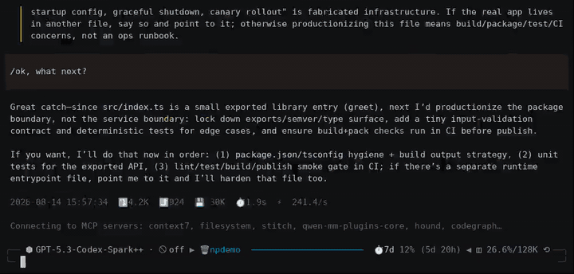
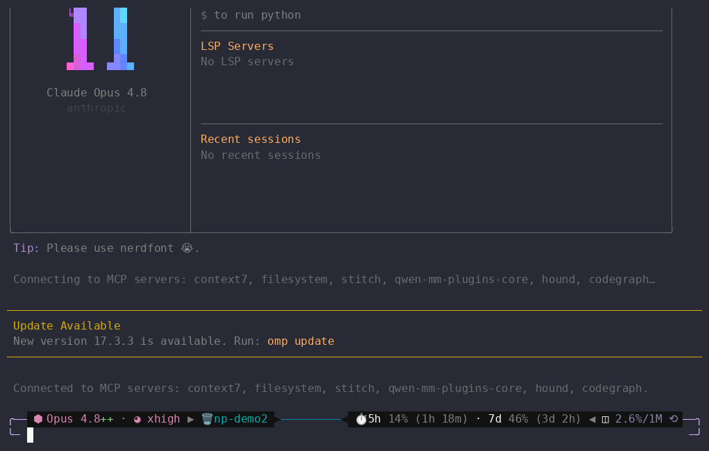

# omp-autosuggest-reply

Fork of [gamaraan/next-prompt-extension](https://github.com/gamaraan/next-prompt-extension)
with a **decision-gated suggestion carousel**: after a turn settles, one model
call classifies whether the latest agent message needs user input and, when it
does, returns up to three likely replies. Left/right (or **Alt+<** / **Alt+>**)
wrap that turn's list; **Enter** fills the box without sending.

**Suggestion carousel — Oh My Pi (OMP)**



**Suggestion carousel — Pi**


**Enhance prompt — Oh My Pi (OMP)**



**Enhance prompt — Pi**


A [pi](https://github.com/earendil-works/pi-coding-agent) / [Oh My Pi](https://github.com/oh-my-pi) (OMP)
coding-agent extension that, after an agent turn fully settles and the input
editor is empty, asks the suggestion model whether the latest agent message
needs the user to decide, confirm, clarify, provide missing information, or
take an action. It shows up to three likely replies when the model finds one of
those needs; a `NONE` result renders nothing. Three render modes:

- **`widget`** (default) — a colored below-editor line:
  `↳ next: <suggestion>  (Enter · 1/3 ←→)`
- **`ghost`** — inline greyed ghost text **in the input box** (renders even when the
  editor is unfocused, e.g. after switching tabs/apps)
- **`both`** — inline ghost AND the below-editor widget simultaneously

> **OMP editor-coexistence note:** `ghost`/`both` work on OMP too. OMP has no
> public editor-owner getter, so next-prompt cannot detect another custom-editor
> extension that installed first in the same session — the last installer wins
> there (Pi captures and can restore the prior owner). If ghost rendering ever
> fails, the default editor is restored and the mode falls back to widget.

Accept with **Enter** (default; configurable) to fill the input box — the first
press does not send. While a suggestion is showing and the editor is empty,
**left** / **right** or **Alt+<** / **Alt+>** wrap through that turn's batch
(one model call, up to 3 distinct lines). A new settle discards the previous
batch. Escape and up/down dismiss; any other key also dismisses. Backspace
down to empty re-arms the last suggestion after a short delay (no new model
call). No suggestion while streaming; the suggestion is cleared and any
in-flight model call aborted the instant you submit, start a turn, or the
agent starts.

> **Opt-in — off by default, per session.** The extension makes no background
> model calls and installs no terminal-input listener or custom editor until it
> is turned on; the settle subscription remains registered but gated to a no-op.
> Toggle it live for the current session at any turn with `/autosuggest-reply on`
> (and `off`) — the same way `/advisor` works, with no file editing and no reload.
> The config `enabled` field sets the per-session **default** (see Configure).
> Useful when you run many sessions and only want suggestions in the ones you type in.
> Headless/background sessions, including subagents, never compute regardless.

## Suggestion carousel

> **Manual mode (saves quota).** Set `"autoSuggest": false` and nothing
> computes on settle — press **Ctrl+Down** (configurable `suggestKey`) on an
> empty editor or run `/autosuggest-reply suggest` to compute one batch on
> demand. While it runs, the widget shows `↳ suggesting…` (mirroring the
> enhance `↳ enhancing prompt…` hint). No background model calls otherwise.

Each settled turn is one model call. The built-in prompt asks the model whether
the latest agent message requires a user reply. It instructs the model to return
`NONE` for completed work, answers, explanations, status updates, and optional
follow-up invitations that require no input. A `NONE` result renders nothing;
otherwise the model returns one batch of up to three distinct one-line replies
and shows the first. This is a semantic, model-evaluated gate, so classification
quality depends on the selected model.

Each reply is one clear action or decision and at most 12 words. Regardless of
a custom `systemPrompt`, a reply that exactly repeats a user or assistant
transcript line is dropped.

- **Right** / **Left**, or **Alt+>** / **Alt+<**, wrap through that turn's list.
  There is no extra model call and no browsing of previous turns.
- A new settle, submit, `/new`, or agent start discards the previous batch.
- **Enter** (default; configurable) fills the editor with the currently shown
  item and does not submit. A second Enter sends the filled prompt.
- The hint is `(Enter · ←→)` for a single suggestion and `(Enter · 2/3 ←→)` when
  the batch has more than one item.

## Enhance prompt

Type a prompt, press **Ctrl+Up** (configurable `enhanceKey`, default `ctrl+up`), and
next-prompt rewrites what's in the box for clarity **without changing your intent
or meaning** — grammar, ambiguity, and structure only. The rewrite replaces the
box in place; press **Ctrl+Up** again or **Esc** to revert to your original (cached,
no extra model call), and Ctrl+Up once more to re-apply. Editing the box commits the
current text and drops the revert.

- Only the text you typed is sent — never the conversation transcript. Secrets
  are redacted first; since the original is always one keystroke away, redaction
  never loses your text.
- Uses the same model resolution and `allowCrossProvider` setting as suggestions
  (see Security). No separate prompt appears for a different destination.
- Fires whenever the key is pressed on a non-empty editor, including while the
  agent is running. Submitting, a new turn, or agent start aborts an in-flight
  rewrite.
- Disable with `"enhanceEnabled": false`.

## Install

Pi and OMP auto-discover extensions from standard locations. Install this fork
from GitHub so you get the batch carousel.

### From GitHub (this fork)

The source repository is [`dnth/omp-autosuggest-reply`](https://github.com/dnth/omp-autosuggest-reply):

```bash
pi install git:github.com/dnth/omp-autosuggest-reply
```

To pin a branch, tag, or commit, append the reference:

```bash
pi install git:github.com/dnth/omp-autosuggest-reply@main
```

### OMP

Install through the OMP plugin manager (observed from `omp plugin --help` /
`omp plugin install --dry-run`):

```bash
omp plugin install github:dnth/omp-autosuggest-reply
```

Pin a branch, tag, or commit the same way:

```bash
omp plugin install github:dnth/omp-autosuggest-reply@main
```

After installing, run `omp plugin doctor` and confirm zero plugin errors. The
package manifest uses the `pi.extensions` form, which OMP accepts directly and
loads with its legacy `@earendil-works/pi-*` import remapping — there is no
separate OMP package.

### GitHub only

Install **only from GitHub** with a command above — that's the whole story.
There is no separate npm or registry package for this fork, and no package name
to install.

### Manual — copy the file

Copy `next-prompt.ts` into your global pi extensions directory:

```bash
cp next-prompt.ts ~/.pi/agent/extensions/next-prompt.ts
```

Or, for a single project only, place it in the project-local extensions directory
(loads after the project is trusted):

```bash
cp next-prompt.ts .pi/extensions/next-prompt.ts
```

### Manual — reference from settings

Add the path to the `extensions` array in `~/.pi/agent/settings.json`:

```json
{
  "extensions": [
    "/absolute/or/relative/path/to/next-prompt.ts"
  ]
}
```

Restart `pi` (or start a new session) after installing.

## Configure

### Command: `/autosuggest-reply <on|off|suggest|status|configure>`

Mirrors `/advisor`. Control the extension per session, at any turn:

- **`on`** / **`off`** — enable or disable suggestions (and enhance) for the
  current session immediately. This is the primary control; it overrides the
  configured default without editing files or reloading.
- **`suggest`** — compute one suggestion batch now, on demand. Works in both
  auto and manual (`autoSuggest: false`) modes; needs an empty editor while
  idle.
- **`status`** — show whether this session is on/off, the configured default, and
  the resolved model, render mode, trigger mode, thinking level, accept key, and enhance key.
- **`configure`** — a guided walkthrough of **every option except `systemPrompt`
  and `enhanceSystemPrompt`** (config-file only): the per-session default, a model
  picker, render mode, thinking level, accept key, re-arm delay,
  transcript/recent-turn/suggestion caps, cross-provider disclosure, the
  enhance-prompt toggle + key, and the auto/manual trigger + suggest key. Saved to the host agent dir
  (`~/.pi/agent/next-prompt.json` on Pi, `~/.omp/agent/next-prompt.json` on OMP);
  the host reloads so changes take effect immediately.

### Config file

All fields optional. Merged global + project (project overrides global **per top-level
key**; the nested `model` block is replaced wholesale, not merged). The config root
comes from the host's `CONFIG_DIR_NAME`:

| Host | Global | Project |
| --- | --- | --- |
| Pi | `~/.pi/agent/next-prompt.json` | `<cwd>/.pi/next-prompt.json` |
| OMP | `~/.omp/agent/next-prompt.json` | `<cwd>/.omp/next-prompt.json` |

```json
{
  "enabled": true,
  "model": { "provider": "ollama", "model": "deepseek-v4-flash:0731-cloud" },
  "thinking": "low",
  "acceptKey": "enter",
  "autoSuggest": false,
  "suggestKey": "ctrl+down",
  "renderMode": "both",
  "rearmDelayMs": 2000,
  "maxTranscriptChars": 12000,
  "maxRecentTurns": 10,
  "maxSuggestionChars": 120,
  "allowCrossProvider": false,
  "enhanceEnabled": true,
  "enhanceKey": "ctrl+up"
}
```

| Field | Default | Notes |
| --- | --- | --- |
| `enabled` | `false` | **Per-session default (opt-in).** Whether a session *starts* with the extension on. A `false` default installs no terminal-input listener or custom editor and makes no background model call until you run `/autosuggest-reply on`; the registered settle handler remains gated to a no-op. The live command overrides this per session. Project config overrides global. Headless/background sessions (including subagents) never compute regardless. |
| `model` | current model (`ctx.model`) | `{ provider, model }`. If the configured model isn't found, pi notifies once (`warning`) and falls back to the current model. |
| `thinking` | unset | Reasoning level for the suggestion model: `"minimal"`/`"low"`/`"medium"`/`"high"`/`"xhigh"`/`"max"`. Set `"low"` for faster suggestions. Passed as `reasoning` to the model call. |
| `acceptKey` | `"enter"` | Any pi-tui `KeyId` (e.g. `"enter"`, `"alt+/"`, `"ctrl+space"`). Intercepted **before** the base editor. Accept only fires when a suggestion is showing and the editor is empty, so the first Enter fills the box and a second Enter submits. |
| `autoSuggest` | `true` | Settled turns auto-compute suggestions. Set `false` for manual-only mode: no model call on settle, only via `suggestKey` or `/autosuggest-reply suggest`. Zero background quota otherwise. |
| `suggestKey` | `"ctrl+down"` | Any pi-tui `KeyId` that computes one batch on demand. Fires only while idle with an empty editor. `"enter"`/`"tab"` are rejected (submit/autocomplete conflicts). Prefer a non-shift key (see `enhanceKey` note). |
| `renderMode` | `"widget"` | `"widget"` (below-editor line), `"ghost"` (inline greyed text in the box), or `"both"` (inline ghost + below-editor widget). On OMP, `ghost`/`both` work too (see the editor-coexistence note above). |
| `rearmDelayMs` | `2000` | Delay (ms) before re-arming the last suggestion after the user deletes back to empty. No new model call. |
| `systemPrompt` | built-in extractor | Config-file only (not prompted by `/autosuggest-reply configure`). Custom instructions replace the reply-format portion, but the required-reply gate is always appended and overrides conflicts. See `SYSTEM_PROMPT` in `next-prompt.ts`. |
| `maxTranscriptChars` | `12000` | Tail-truncation of the conversation transcript sent to the model. |
| `maxRecentTurns` | all | Disclosure minimization: only the last N user/assistant turns are sent (tool results are never sent regardless). Invalid values fail closed — suggestions are disabled. |
| `maxSuggestionChars` | `120` | Cap on the returned suggestion length (visible width; a hard code-point bound of 4× this value also applies, so zero-width payloads cannot bypass the cap). |
| `allowCrossProvider` | `false` | Global cross-destination opt-in. When `true`, the configured suggestion model may receive text even when its provider, endpoint, or model route differs from the active model; no per-project consent dialog appears. When `false`, the extension silently falls back to the active model. Project config can never loosen a global `false`. |
| `enhanceEnabled` | `true` | Enables the enhance-prompt keybinding (rewrite the typed prompt in place). Fires on a non-empty editor even while the agent is active; sends only the typed text, never the transcript. Disabled automatically when a privacy-invalid config fails closed. |
| `enhanceKey` | `"ctrl+up"` | Any pi-tui `KeyId` that enhances the current editor text. Same key (or Esc) reverts to the original; editing commits. Must differ from `acceptKey`; `"enter"`/`"tab"` are rejected. Prefer a non-shift key — a shift-bearing symbol like `alt+?` cannot match under terminals' enhanced keyboard protocols (xterm modifyOtherKeys / kitty). |
| `enhanceSystemPrompt` | built-in | Config-file only (not prompted by `/autosuggest-reply configure`). Overrides the enhance instruction; see `ENHANCE_SYSTEM_PROMPT` in `next-prompt.ts`. |

### Why `enter` is the default accept key

- **`enter`** — while a suggestion is showing on an empty editor, the first
  Enter fills the box and is consumed so it does not send. After the box has
  text, Enter is a normal submit. Matches picker UX: arrows browse, Enter
  chooses.
- **`tab`** — conflicts with pi's path-autocomplete and `/template` dropdown.
- **`ctrl+tab`** — many terminals send it as plain `tab`/`\t` or swallow it (window/tab switcher), so it's unreliable.
- **`ctrl+space`** — works (sends `\x00`, which pi-tui maps to `ctrl+space`); the extension intercepts it before the base editor so it no longer pollutes, but some terminals remap Ctrl-Space to IME toggle.
- **`alt+/`** — still a good custom binding (`"acceptKey": "alt+/"`) if you
  want Enter to always submit.

Override with any `KeyId`, e.g. `"acceptKey": "alt+/"`.

## Security: cross-provider transcript disclosure

The extension sends the conversation transcript (user + assistant text only — tool
results, thinking blocks, and tool-call arguments are skipped) to the suggestion
model. This is **no more** than what the active model already saw **if** the
suggestion model is on the **same destination** as the active model. A destination
is the provider label **plus** the endpoint origin **plus** the resolved model's
routing id: two different downstream models behind one gateway (e.g. `openai/gpt`
and `openai/claude` at the same `https://gateway.example/v1`) are **different**
destinations. If you configure a suggestion model on a **different** destination,
the transcript is sent to that second destination, which may have different
data-handling terms.

Cross-destination disclosure is explicit and fail-closed:

- `allowCrossProvider` defaults to `false`. With `false`, a configured model on a
  different destination is never used; the extension silently falls back to the
  active model (and, when there is no active model, computes nothing).
- Setting `allowCrossProvider` to `true` is global consent for the configured
  suggestion model to receive text across providers, endpoints, and model routes.
  The extension does not ask again per project or destination.
- Project config (`<cwd>/.pi/next-prompt.json` on Pi, `<cwd>/.omp/next-prompt.json`
  on OMP) is only honored for **trusted** projects, and can never loosen a global
  `allowCrossProvider: false` or increase a global `maxTranscriptChars` cap —
  repository content cannot silently redirect your transcript. Pi gates project
  config on its `isProjectTrusted()` API. **OMP exposes no project-trust API**, so
  OMP follows the configuration loader's default (trusted) and enforces the same
  global privacy floors. An existing-but-unreadable or syntactically invalid
  global/project config disables suggestions entirely rather than falling back to
  defaults (both hosts).

Mitigations:

- `buildTranscript` redacts obvious high-entropy secrets (AWS `AKIA…`, OpenAI
  `sk-…`/`sk-proj-…`/`sk-ant-…`, GitHub `ghp_…`/`github_pat_…`, GitLab `glpat-…`,
  Google `AIza…`, Slack `xoxb-…`, JWTs, PEM private key blocks, and `key=value`
  assignment forms) from both user and assistant text before sending. This is
  defense-in-depth, **not** comprehensive secret detection — explicit
  `allowCrossProvider` configuration and least disclosure are the primary controls.
- `maxRecentTurns` minimizes what is sent by limiting the transcript to the last
  N turns.
- Suggestion output is sanitized before rendering: terminal control sequences
  (OSC/CSI/DCS/APC/PM/SOS — both ESC-prefixed and 8-bit forms), C0/C1 controls,
  DEL, carriage returns, bidi overrides, unpaired surrogates, and oversized
  zero-width payloads are stripped or bounded, so model text can never execute
  terminal commands (e.g. OSC 52 clipboard writes).

## How it works

1. On `session_start` (interactive mode only — Pi TUI `ctx.mode === "tui"`, OMP
`ctx.hasUI === true`; headless/RPC/JSON sessions never compute), the configured
`enabled` value seeds the session state. When it is on—or after
`/autosuggest-reply on`—a global `ctx.ui.onTerminalInput` listener is registered
to detect the accept key **editor-independently**. `ghost`/`both` install a
render-only `GhostEditor` via `setEditorComponent` — never re-installed on
settle. `/autosuggest-reply off` removes that listener and editor immediately.
If another extension owns
the editor on Pi, the ghost is **still attempted** (with a warning); only if the
ghost install or its render pass actually fails does the extension restore the
prior owner and fall back to widget mode. On OMP there is no editor-owner getter,
so a failed ghost restores the **default** editor instead; OMP also has no
host-side extension-editor teardown, so next-prompt resets its editor to default
at the next `session_start`. The host clears extension listeners when the UI is
reset; each fresh `session_start` (reload/new/resume/fork) resets the live toggle
to the configured default, then installs at most one listener and editor.
2. On completion:
   - **Pi:** `agent_settled` (its fully-settled contract) — if the editor is
     empty, the controller calls
     `ctx.modelRegistry.complete(model, { systemPrompt, messages }, { signal, reasoning })`
     with the resolved model, the configured thinking level, and the (redacted,
     tail-truncated) transcript.
   - **OMP:** only a **terminal** `agent_end` (never when `event.willContinue`
     is true — continuations, automatic retries, and pending continuation turns
     produce no suggestion) — the controller lazily imports `completeSimple`
     from the remapped legacy pi-ai module and calls
     `completeSimple(model, { systemPrompt: [prompt], messages }, { apiKey: modelRegistry.resolver(model), signal, reasoning })`.
     OMP emits the extension `agent_end` **before** the session fully unwinds
     (`ctx.isIdle()` is still false at handler time), so the terminal event
     itself is treated as the settle signal on OMP; Pi keeps its
     `agent_settled` + real-time idle gates. Stale-output protection is
     identical on both hosts (input-generation bumps, aborts, and render-time
     guards). Pi never loads the OMP module; OMP never calls
     `modelRegistry.complete`.
3. The returned text is parsed as a batch of up to 3 distinct one-line next-prompts
   (numbered/bulleted lines, duplicates, and `NONE` dropped) and shown — via `setWidget`
   (widget/both), via the inline ghost overlay (ghost/both), or both. The hint
   is `(Enter · ←→)` for a single suggestion and `(Enter · 2/3 ←→)` when the batch has more than one item.
4. The accept key is intercepted **before** the base editor: if a suggestion is
   showing on an empty editor, it fills the editor via `ctx.ui.setEditorText`
   and swallows the key (Enter does not submit). Left/right (or Alt+< / Alt+>)
   on an empty editor with a visible suggestion wrap through that turn's batch.
   There is no extra model call; a new settle replaces the list.
   Any other key
   dismisses the suggestion immediately
   (widget and ghost) and delegates to the base editor; deleting back to empty
   re-arms the last suggestion after `rearmDelayMs` (no new model call).
   Dismissing via Escape/up/down never re-arms, and typing invalidates any
   in-flight suggestion request.
5. The enhance key (`enhanceKey`, default `ctrl+up`) is intercepted the same way,
   but acts on a **non-empty** editor: it sends only the typed text (redacted)
   to the resolved model with `ENHANCE_SYSTEM_PROMPT`, then replaces the box with
   the rewrite via `ctx.ui.setEditorText`. The same key or Escape restores the
   cached original; editing commits and drops the cache. Staleness is guarded by
   the input generation and by requiring the editor to still hold the sent text.

## Develop

Clone and run the checks with [Bun](https://bun.sh):

```bash
bun install
bun run typecheck        # Pi API types (default tsconfig.json)
bun run typecheck:omp    # OMP 17.2.12 API types (tsconfig.omp.json)
bun test
bun run verify:package
```

The extension imports `@earendil-works/pi-coding-agent`, `@earendil-works/pi-tui`, and
`@earendil-works/pi-ai`. These are provided by your pi installation — list them in
`peerDependencies` with `"*"` (do not bundle). If your editor's TypeScript LSP can't
resolve them, link them from your pi install's `node_modules` (git-ignored here;
nothing is downloaded). The pinned `@oh-my-pi/*` packages are **dev-only** test
dependencies for `tsconfig.omp.json` — they never appear in `peerDependencies` or
runtime imports; on OMP the legacy `@earendil-works/pi-*` imports are remapped to
the host's bundled packages at load time.

Edit `next-prompt.ts` in place and restart the host (pi or OMP) to pick up changes.

## Compatibility

**Pi:** supported range **0.84.0 – latest (0.84.x at time of writing)**.
`ModelRegistry.complete()` — which the extension calls directly — was added in
pi 0.84.0, so older 0.80–0.83 releases are not supported. CI runs the unit suite
and typecheck against both the oldest supported and the latest published
`@earendil-works/pi-*` packages (`.github/workflows/test.yml` — `compat` job) on
every PR.

**OMP:** supported first against **17.2.12** (the researched API version). OMP
runs the extension through its legacy `pi.extensions` manifest and
`@earendil-works/pi-*` import remapping — the same published package works on both
hosts. OMP-specific behavior:

- Lifecycle: suggestions compute on a **terminal `agent_end`** only;
  `willContinue: true` events (tool-loop continuations, automatic retries) never
  compute. Pi keeps its `agent_settled` contract.
- Transport: OMP completes via `completeSimple` + the model registry's auth
  resolver; Pi keeps `modelRegistry.complete`.
- Rendering: OMP supports `widget`, `ghost`, and `both`; because OMP has no
  editor-owner getter, a ghost failure restores the default editor (Pi restores
  the captured prior owner) and another custom-editor extension installed first
  in the same session is not detected.
- Trust: OMP has no project-trust API; project config follows the loader default
  and global privacy floors remain enforced.

CI adds an OMP job that typechecks against the pinned `@oh-my-pi/*` 17.2.12
surface (`bun run typecheck:omp`), runs the full unit suite, packs/inspects the
extension artifact, and validates plugin discovery + `omp plugin doctor` in an
isolated profile.

## Manual TUI smoke tests

Terminal-rendering and live-interaction behavior cannot be fully verified in unit
tests. Before a release, run the checklist in
[`TUI_SMOKE_TEST.md`](./TUI_SMOKE_TEST.md) in a real pi session AND a real OMP
session, and record the results.

## Design & development

Source and design discussion live in this
[fork](https://github.com/dnth/omp-autosuggest-reply). The original project is
[gamaraan/next-prompt-extension](https://github.com/gamaraan/next-prompt-extension).

## License

MIT — see [LICENSE](https://github.com/dnth/omp-autosuggest-reply/blob/main/LICENSE).
